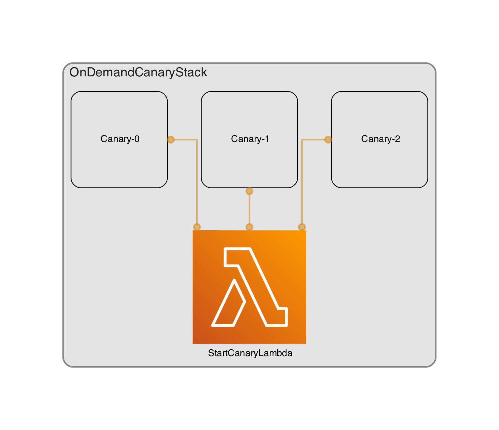

# On-demand CloudWatch Synthetics Tests

POC for a Lambda that executes n number of [CloudWatch Synthetics](https://docs.aws.amazon.com/AmazonCloudWatch/latest/monitoring/CloudWatch_Synthetics_Canaries.html) tests and waits their success.

The `cdk.json` file tells the CDK Toolkit how to execute your app.

## Useful commands

* `npm run build`       compile typescript to js
* `npm run watch`       watch for changes and compile
* `npm run test`        perform the jest unit tests
* `cdk deploy`          deploy this stack to your default AWS account/region
* `cdk diff`            compare deployed stack with current state
* `cdk synth`           emits the synthesized CloudFormation template
* `npm run test:lambda` test lambda locally
* `npm run diagram`     re-generate cdk diagram
* `npm run cdk:dep`     run all commands to build and deploy cdk application

## Resources and References

* https://docs.aws.amazon.com/AWSJavaScriptSDK/v3/latest/clients/client-synthetics/
* https://github.com/pistazie/cdk-dia
* https://github.com/aws/aws-cdk
* https://github.com/simonireilly/canary-stack
* https://github.com/markusl/aws-cdk-nodejs18-lambda-aws-js-sdk-v3/blob/main/cdk/lib/example-lambda-stack.ExampleFunction.ts